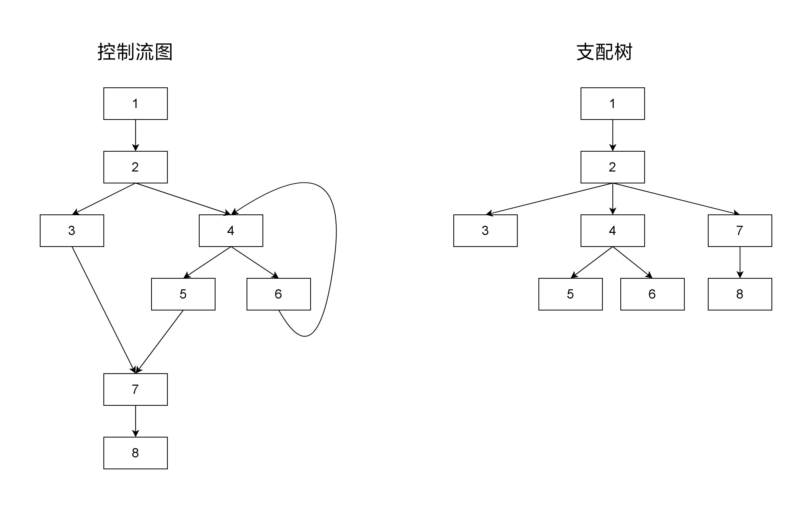
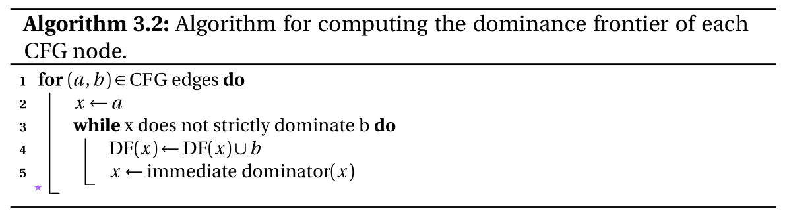
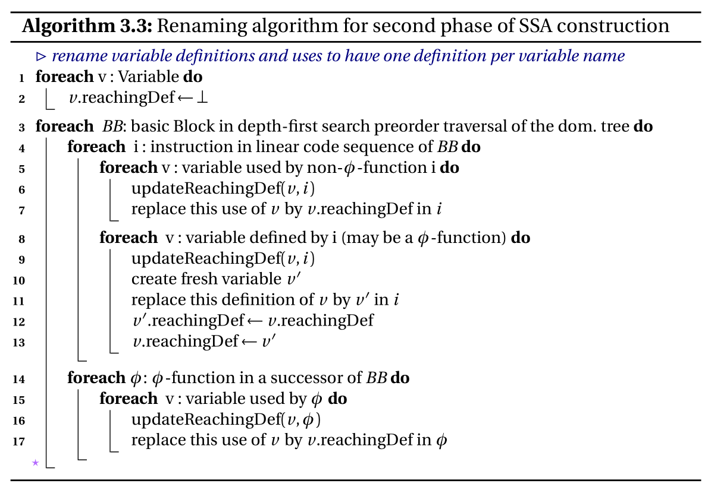
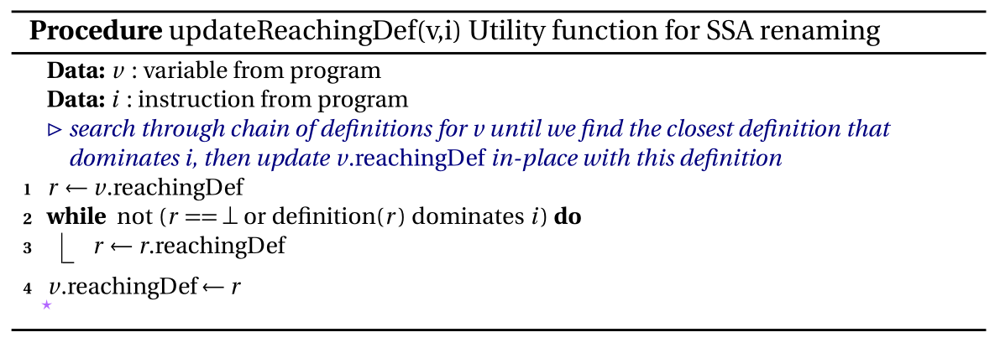

# mem2reg 实验指导

> 本部分的知识仅供 mem2reg 挑战实验使用，部分参考了 _Static Single Assignment book_ 和 _Engineering a Compiler_。部分名词为助教自行翻译，如有困惑还请参考原书。

## 简介

在 [LLVM 中的 SSA](../../pre/llvm_ir_ssa.md) 中，我们简单地介绍了 SSA 的相关知识。LLVM IR 借助只要求虚拟寄存器是 SSA 形式，而内存不要求是 SSA 形式的特点开了个后门。编译器前端在生成 LLVM IR 时，可以选择不生成真正的 SSA 形式，而是把局部变量生成为 `alloca/load/store` 形式。

LLVM 以 pass（遍）的形式管理对 LLVM IR 的转换、分析或优化等行为，mem2reg 就是其中的一个 pass。在 mem2reg 中，LLVM 会识别出局部变量的 `alloca` 指令，将对应的局部变量改为虚拟寄存器中的 SSA 形式的变量，将该变量的 `store/load` 修改为虚拟寄存器之间的 def-use/use-def 关系，并在适当的地方加入 `phi` 指令和进行变量的重命名。

比如对于以下的代码：

```cpp
int main() {
    int x, cond = 1;
    if (cond > 0)
        x = 1;
    else
        x = -1;
    return x;
}
```

对应的 `alloca/load/store` 形式的 IR 如下：

```llvm
define dso_local i32 @main() {
    %1 = alloca i32
    %2 = alloca i32
    store i32 1, i32* %1
    %3 = load i32, i32* %1
    %4 = icmp sgt i32 %3, 0
    br i1 %4, label %5, label %8

5:
    store i32 1, i32* %2
    br label %6

6:
    %7 = load i32, i32* %2
    ret i32 %7

8:
    %9 = sub i32 0, 1
    store i32 %9, i32* %2
    br label %6
}

```

进行 mem2reg 后，对应的 IR 如下：

```llvm
define dso_local i32 @main() {
    %1 = icmp sgt i32 1, 0
    br i1 %1, label %2, label %5

2:
    br label %3

3:
    %4 = phi i32 [ 1, %2 ], [ %6, %5 ]
    ret i32 %4

5:
    %6 = sub i32 0, 1
    br label %3
}
```

对比发现，`alloca/load/store` 形式的 IR 中的 `%1, %2` 分别对应 `x` 和 `cond`，所有对它们的 `load` 指令的值（如 `%3, %7`）的使用被替换成了对应的 `store` 所写入的值。而在 mem2reg 后的 IR 的 `3` 基本块中，加入了一条 `phi` 指令，该指令根据在当前基本块执行之前执行的是哪一个基本块取不同的值。如果控制流是从 `2` 跳转到了 `3`，`%4` 取 `1`；如果控制流是从 `5` 跳转到了 `3`，`%4` 取 `%6`。需要注意一点：一个基本块中的所有 `phi` 指令都必须在该基本块的开头，且 `phi` 指令是并行取值的（当然不是机器层面的并行，只是在逻辑上要求并行），请看下面的例子：

```llvm
define dso_local i32 @main() {
    %1 = icmp slt i32 0, 5
    br i1 %1, label %6, label %2

2:
    %3 = phi i32 [ 0, %0 ], [ %10, %6 ]
    %4 = phi i32 [ 0, %0 ], [ %7, %6 ]
    %5 = phi i32 [ 0, %0 ], [ %11, %6 ]
    ret i32 %5

6:
    %7 = phi i32 [ 0, %0 ], [ %10, %6 ]
    %8 = phi i32 [ 0, %0 ], [ %7, %6 ]
    %9 = phi i32 [ 0, %0 ], [ %11, %6 ]
    %10 = add i32 %7, 1
    %11 = add i32 %9, 1
    %12 = icmp slt i32 %7, 5
    br i1 %12, label %6, label %2
}
```

这段 IR 解释执行后返回值为 `6`，而将 `%10 = add i32 %7, 1` 改为 `%10 = add i32 %8, 1` 后，返回值却变成了 `10`，造成这样区别的原因就在于 `phi` 指令的并行取值：一个基本块里的 `phi` 指令是同时取值的，每次从 `6` 跳转到 `6` 块时，`%8` 取的 `%7` 的值是跳转之前的 `%7` 的值，而非 `%7` 所取的 `%10` 的值。

## 前置概念

- **定义**：对变量进行初始化、赋值等改变变量的值的行为。
- **使用**：在语句/指令中将变量的值作为参数的行为。
- **控制流图**（Control Flow Graph, CFG）：一个程序中所有基本块执行的可能流向图，图中的每个节点代表一个基本块，有向边代表基本块间的跳转关系. CFG 有一个入口基本块和一/多个出口基本块，分别对应程序的开始和终止.
- **支配**（dominate）：对于 CFG 中的节点 $$n_1$$ 和 $$n_2$$，$$n_1$$ 支配 $$n_2$$ 当且仅当所有从入口节点到 $$n_2$$ 的路径中都包含 $$n_1$$，即 $$n_1$$ 是从入口节点到 $$n_2$$ 的必经节点. 每个基本块都支配自身.
- **严格支配**（strictly dominate）：$$n_1$$ 严格支配 $$n_2$$ 当且仅当 $$n_1$$ 支配 $$n_2$$ 且 $$n_1\neq n_2$$.
- **直接支配者**（immediate dominator, idom）：节点 $$n$$ 的直接支配者是离 $$n$$ 最近的严格支配 $$n$$ 的节点（标准定义是：严格支配 $$n$$，且不严格支配任何严格支配 $$n$$ 的节点的节点）. 入口节点以外的节点都有直接支配者. 节点之间的直接支配关系可以形成一棵支配树（dominator tree）.

下图展示了一个 CFG 和对应的支配树：



- **支配边界**（dominance frontier）：节点 $$n$$ 的支配边界是 CFG 中刚好**不**被 $$n$$ 支配到的节点集合. 形式化一点的定义是：节点 $$n$$ 的支配边界 $$DF(n) = \{x | n 支配 x 的前驱节点，n 不严格支配 x\}$$.

在一个基本块 `x` 中对变量 `a` 进行定义，在不考虑路径中对变量进行重新定义（kill）的情况下，所有被 `x` 支配的基本块中，`a` 的值一定是 `x` 中所定义的值。而对于 `x` 的支配边界中的基本块，情况则有所不同——它们的控制流不一定来自于 `x`，`a` 的值只是有可能是 `x` 中所定义的值。在支配边界所支配的基本块中，当然也无法确定 `a` 的值，支配边界是恰好不能确定 `a` 是否取 `x` 中所定义的值的分界线。例如上面的图中，`4` 支配 `7` 的前驱节点 `5`，但是 `4` 不支配 `7`，`4` 的支配边界是 `{7}`，如果有个变量 `a` 在 `2` 中被声明，在 `3` 和 `4` 中分别被定义为 0 和 1，我们不能确定在程序执行到 `7` 时 `a` 的值是 0 还是 1。

计算 CFG 中每个节点的支配边界的算法如下：



为了简单起见，我们定义一个节点集的支配边界是集合中所有节点的支配边界的并集。

- **迭代支配边界**（iterated dominance frontier）：节点集 $$S$$ 的迭代支配边界 $$DF^{+}(S)$$ 是通过迭代地计算支配边界，直到到达一个不动点得到的. 迭代方式为：$$DF^{+} (S) = DF_{i\to \infty}(S),~ ~ DF_1(S)=DF(S), ~ ~ DF_{i+1}(S)=DF(S\cup DF_i(S))$$.

## SSA 构造算法

下面的 SSA 构造算法是构造 SSA 的算法的一种，是对 [_Static Single Assignment book_](https://pfalcon.github.io/ssabook/latest/) Chapter 3: Standard Construction and Destruction Algorithms 中的部分内容的拙劣整合和翻译。如果你对其中的任何内容有困惑，可以直接阅读原文。

> _Static Single Assignment book_ [官方发行链接](https://gforge.inria.fr/projects/ssabook/)失效，原因未知。

学有余力想要了解更多 SSA 相关内容请参考 _Static Single Assignment book_ 或其他编译优化相关书籍。

SSA 的构造分为两个阶段：插入 $$\phi$$ 函数和进行变量重命名。

### 插入 phi 函数

如果从变量 $$v$$ 的一个定义点 $$d$$ 出发，存在一条路径到达程序中的另一点 $$p$$，并且在该路径上不存在对 $$v$$ 的其他定义语句，那么我们称对 $$v$$ 的定义 $$d$$ 能够**到达** $$p$$，说明在 $$p$$ 处对 $$v$$ 的取值**可能**是在 $$d$$ 处定义的。如果路径上存在一个对 $$v$$ 的其他赋值语句，即在路径上有一个定义点 $$d'$$ 也对 $$v$$ 进行了定义，那么定义点 $$d$$ 就被 $$d'$$ “杀死”（kill） 了。

如果一个程序中没有一个位置可以被同一个变量的两个及以上的定义到达，那么这个程序满足单一到达定义属性（single reaching-definition property）。在这样的程序中，如果 $$v$$ 的定义 $$d$$ 能够到达 $$p$$，那么在 $$p$$ 处对 $$v$$ 的取值**一定**是在 $$d$$ 处定义的。

插入 $$\phi$$ 函数的目标是生成满足单一到达定义的程序。如果我们在每个基本块的开头对基本块中的变量所使用的变量都分别设置一个 $$\phi$$ 函数，在 $$\phi$$ 函数处合并来自多个不同前驱基本块的对同一个变量的多个定义，显然是可以单一到达定义的要求的，但显然这样会生成大量的 $$\phi$$ 函数，产生很多的冗余代码，因此我们也要尽可能地减少 $$\phi$$ 函数的数量。

我们可以发现，只有在来自多个基本块的控制流汇合到一个基本块中时，才会出现同一个变量的多个不同定义，我们定义这样的有多个前驱的基本块为汇合点（join node）。对于一个基本块集合 $$S$$，如果一个基本块是 $$S$$ 中的至少两个基本块的汇合点，那么这个基本块是这个集合的汇合点。基本块集合 $$S$$ 的汇合点集记为 $$J(S)$$。

如果基本块 $$n_1$$ 和 $$n_2$$ 中都对 $$v$$ 进行了定义，那么我们需要在 $$J({n_1,n_2})$$ 中，$$n_1,~n_2$$ 的定义可以到达的所有基本块的开头对 $$v$$ 设置一个 $$\phi$$ 函数。推广一下，定义变量 $$v$$ 的所有基本块集合为 $$\textrm{Defs}(v)$$，我们需要在 $$J(\textrm{Defs}(v))$$ 中的所有基本块的开头对 $$v$$ 设置 $$\phi$$ 函数，这些 $$\phi$$ 函数也是对 $$v$$ 的定义，它们对应的 $$\phi$$ 函数需要在 $$J(\textrm{Defs}(v)\cup J(\textrm{Defs}(v)))$$ 中设置。不过我们可以注意到 $$J(S\cup J(S)) = J(S)$$，因此可以得出结论为：在 $$J(\textrm{Defs}(v))$$ 中对 $$v$$ 设置 $$\phi$$ 函数，我们就能在生成满足单一到达定义的程序的同时插入较少的 $$\phi$$ 函数。

计算 $$J(\textrm{Defs}(v))$$ 非常麻烦，不过还记得之前的迭代支配边界吗？我们有 $$DF^{+}(S) = J(S\cup \{\textrm{entry}\})$$，其中 $$\textrm{entry}$$ 为程序的入口基本块。如果变量在 $$\textrm{entry}$$ 中被定义，我们有 $$\textrm{Defs}(v)\cup \textrm{entry} = \textrm{Defs}(v)$$，而如果变量在 $$\textrm{entry}$$ 中没有被定义，这个 $$\phi$$ 函数也可以正常构建，只不过控制流来自 $$\textrm{entry}$$ 时值为未定义，导致程序出现未定义行为。算法原作者在描述算法时默认所有的变量都在入口基本块中被定义一次，因此不会出现未定义行为。在我们的实验测试用例的中，可能会出现带有未定义值的 $$\phi$$ 函数，但保证不会出现未定义行为。所以我们只需要计算出 $$\textrm{Defs}(v)$$ 的迭代支配边界，就能够知道要在哪些基本块中插入 $$v$$ 对应的 $$\phi$$ 函数。

现在，我们已经有了每个基本块的支配边界，基本块的迭代支配边界会在插入 $$\phi$$ 函数的过程中迭代地计算出来。插入 $$\phi$$ 函数的算法如下：


在程序中插入 $$\phi$$ 函数后，程序中地每个变量依然会有多个定义，但程序中的每个定义都可以确定地到达对它的使用，在程序的任意一个位置，一定能够唯一地找到一个已定义变量的定义点，不会出现“这个变量可能在这里定义，也可能在那里定义”的情况（这种情况变成了 $$\phi$$ 函数定义了该变量，kill 了原有的多个定义）。

### 变量重命名

为了使程序变为 SSA 形式，我们还需要对变量进行重命名。在程序中插入 $$\phi$$ 函数使得每一个变量的存活区间（live-range）被切割成了几片，变量重命名要做的就是给每个单独的存活区间一个新的变量名，同时维护变量的到达定义以使程序语义和转变为 SSA 形式之前一致。在支配树上进行 DFS，DFS 的过程中，计算并更新每个变量 $$v$$ 当前的定义 $$v.\textrm{reachingDef}$$，并创建新的变量。算法如下：





## SSA 构造算法的应用——LLVM IR 上的 mem2reg

我们的 mem2reg 只需要对局部的 `int` 类型的变量进行处理。

在 mem2reg 之前，你应该已经将 miniSysY 程序编译成了 LLVM IR，并且计算出了 CFG 中的支配关系和每个基本块的支配边界。

插入 `phi` 指令：你需要记录下每个对局部 `int` 类型变量分配空间的 `alloca` 指令，对于每个 `int` 类型的变量，找到所有对应内存空间的 `store` 指令，这些指令对变量进行了定义。然后根据之前给出的插入 $$\phi$$ 函数的算法，在基本块的开头插入空的 `phi` 指令，注意记录好每个 `phi` 指令和变量的对应关系。

变量重命名：遍历所有基本块，在每个基本块中分别遍历每条指令，遇到局部 `int` 类型变量对应的 `alloca` 指令，直接删除即可；遇到局部 `int` 类型变量对应的 `load` 指令，将所有其他指令中对该指令的使用替换为对该变量到达定义的使用，删除 `load` 指令；遇到局部 `int` 类型变量对应的 `store` 指令，你需要更新该变量的到达定义，删除 `store` 指令。遍历完成一个基本块中的所有指令后，你需要维护该基本块的所有后继基本块中的 `phi` 指令，将对应来自此基本块的值设为对应变量的到达定义。

> 变量重命名算法为了满足 SSA “每个变量都有且只有一个赋值语句” 的形式，在对变量进行定义时创建了一个新变量，通过追溯 reachingDef 链来找到原始的 reachingDef。在 LLVM IR 中，我们需要满足的性质实际上是“每个虚拟寄存器都有且只有一个赋值语句”，而我们之前生成的 LLVM IR 已经满足了这一性质，所以我们这里并没有真正地去**重命名**一个变量，而是维护变量的到达定义及指令对变量的使用，使程序和 mem2reg 之前的语义一致。

## 参考文献

1. [如何构建 SSA 形式的 CFG\_山楂片的博客](https://szp15.com/post/how-to-construct-ssa/)
2. [SSA - LLVM-Clang-Study-Notes](https://llvm-clang-study-notes.readthedocs.io/en/latest/ssa/index.html)
3. [对于 LLVM 之类的编译器是如何实现在构造 SSA 形式的 IR 的时候，计算出 def-use 链？ - RednaxelaFX 的回答 - 知乎](https://www.zhihu.com/question/41999500/answer/93243408)
4. Static Single Assignment Book: by lots of authors
5. Engineering a Compiler: by Keith D. Cooper, Linda Torczon
